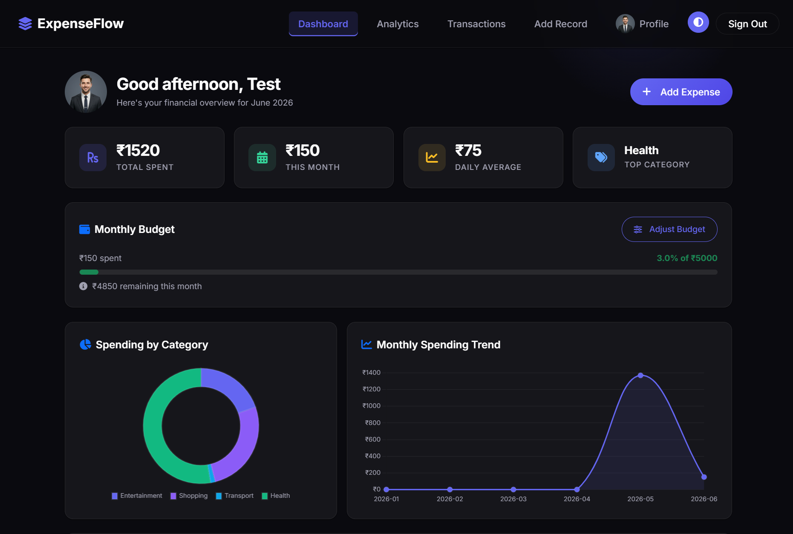
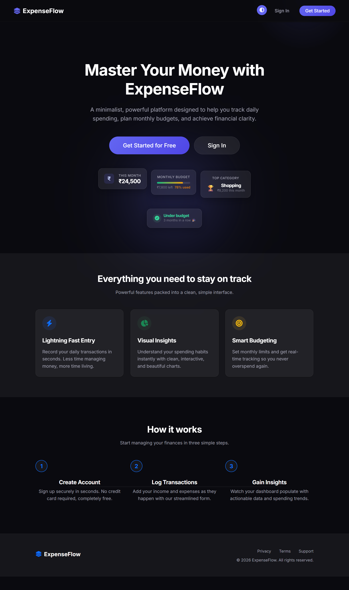
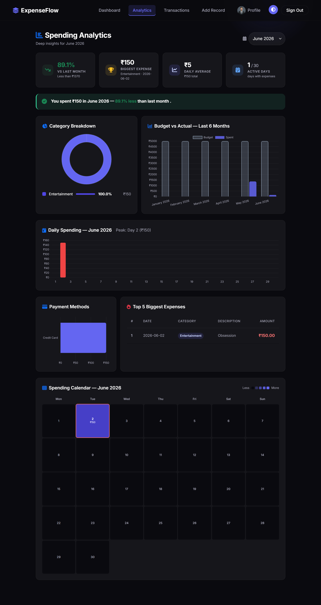
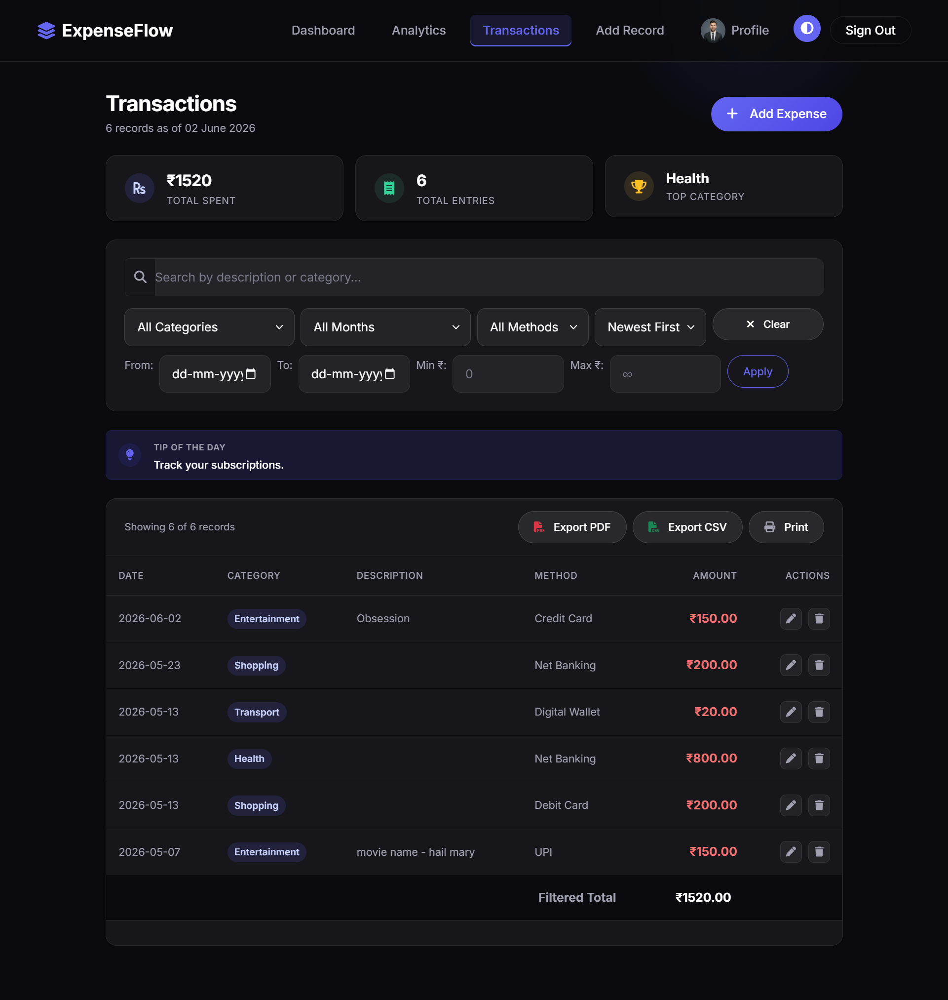
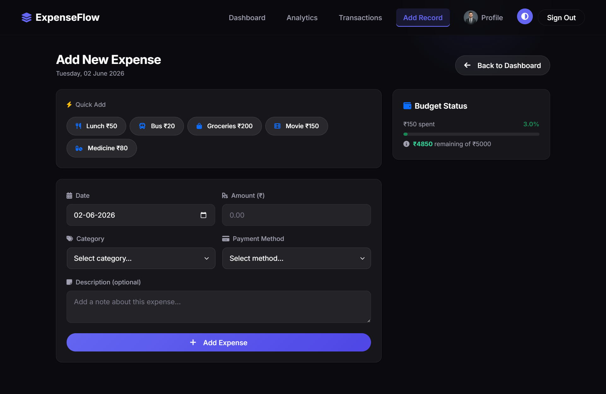

<p align="center">
  
</p>

<h1 align="center">ExpenseFlow</h1>

<p align="center">
  <strong>A premium, full-stack personal finance tracker built with Flask</strong><br>
  Track expenses · Set budgets · Deep Analytics · Smart Dark/Light Modes · Install as PWA
</p>

<p align="center">
  <a href="https://m3hulraj.pythonanywhere.com"><strong>🌐 Live Demo</strong></a> &nbsp;·&nbsp;
  <a href="#features"><strong>Features</strong></a> &nbsp;·&nbsp;
  <a href="#tech-stack"><strong>Tech Stack</strong></a> &nbsp;·&nbsp;
  <a href="#setup"><strong>Setup</strong></a>
</p>

---

## What is ExpenseFlow?

ExpenseFlow is a production-grade personal finance management application designed with a modern **premium fintech aesthetic**. It goes far beyond basic expense tracking — offering real-time budget alerts, 9-section analytics dashboards with GitHub-style heatmaps, beautiful Dark and Light modes, PDF report generation, and Progressive Web App support for mobile installation.

Built as a full-stack Flask application with SQLAlchemy ORM and the **application factory pattern**, it features CSRF protection, login rate limiting, server-side input validation, indexed database queries, comprehensive error handling, session-based authentication with hashed passwords, and a full automated test suite with CI.

---

## Features

### Core — Expense Management
- **Add Expenses** — Quick-add shortcuts, category/payment method selection, date picker with future-date prevention
- **Edit & Delete** — Full CRUD with server-side validation on every field
- **View All Transactions** — Searchable, filterable, sortable table with pagination
- **Multi-filter System** — Filter by category, month, payment method, date range, and amount range simultaneously
- **Savings Tips** — Random financial tip displayed on the Transactions page

### Budgeting
- **Monthly Budgets** — Set a specific budget for any month/year combination
- **Recurring Budgets** — Auto-apply the same budget to all future months
- **Budget Progress Bar** — Dynamic visual progress indicators on Dashboard and Add Expense pages
- **Smart Alerts** — Dismissible banners: amber at 90%+ usage, red at 100%+ (persisted per session via localStorage)

### Analytics & Reporting
- **9-Section Analytics Dashboard** — Month selector, MoM comparison, category breakdown, daily spending bar chart, top 5 expenses, budget history, payment method breakdown, and spending trend
- **GitHub-Style Calendar Heatmap** — Dynamic visual spending legend scaling relative to your highest spending day of the month
- **Dashboard Overview** — 4 stat cards (Total Spent, This Month, True Velocity Daily Average, Top Category), category donut chart, 6-month spending trend line chart
- **True Velocity Analytics** — The daily average dynamically tracks exactly how many days have passed in the current month to enforce real-time budgeting accountability.
- **PDF Export** — Professional ReportLab-generated PDF with indigo header, summary stats, category breakdown table, full paginated expense list, and page numbers
- **CSV Export** — Client-side JavaScript CSV generation with one-click download

### Design & UX
- **Flawless Dark & Light Modes** — Precision-engineered themes that respect OS preferences with a dedicated manual toggle switch
- **Fintech Aesthetic** — Indigo color system, Inter font, premium glassmorphic frosted cards, and smooth micro-animations
- **Responsive Layout** — Full-width dashboard-style layouts optimized for desktop, tablet, and mobile
- **Active Navbar** — Current page highlighted with indigo bottom border
- **Auto-dismissing Flash Messages** — 4-second fade-out with smooth CSS animations
- **Custom Error Pages** — Branded 404 and 500 pages matching the app design
- **Animated Landing Page** — "Vercel-style" glassmorphic stat cards with staggered slide-up entrance animations, infinite floating keyframes, and a dynamic glow orb background.

### User Management
- **Registration & Login** — Secure authentication with Werkzeug password hashing
- **Profile Editing** — Update username, email, and password with duplicate checks
- **Session Management** — Protected routes with login-required redirects

### Progressive Web App (PWA)
- **Installable** — Add to home screen on mobile and desktop
- **Service Worker** — Smart caching with cache-first for static assets, network-first for pages
- **Offline Support** — Branded offline fallback page when network is unavailable
- **App Icons** — Custom 192x192 and 512x512 indigo icons with stacked-layers logo

### Security & Infrastructure
- **CSRF Protection** — All POST forms validated via Flask-WTF CSRF tokens
- **Login Rate Limiting** — Flask-Limiter enforces 5 attempts per 15 minutes on `/login` POST to prevent brute-force attacks
- **SQLAlchemy ORM** — Proper relational models with cascade deletes
- **Application Factory** — `create_app()` pattern with separate production and testing configurations
- **Blueprint Architecture** — Routes split into 5 blueprints (`auth`, `expenses`, `budget`, `analytics`, `main`) for modularity
- **Indexed Queries** — Database indexes on `user_id`, `date`, `username`, `email`, and composite `(user_id, date)`
- **Server-side Validation** — Regex-based input sanitization, whitelist validation for categories and payment methods, future-date blocking
- **Automated Testing** — 26 pytest tests covering CRUD, budget logic, validation, and CSRF enforcement
- **CI/CD** — GitHub Actions workflow runs `pytest tests/ -v` on every push and PR to `main`
- **Structured Logging** — All events logged to `expenseflow.log` with timestamps
- **Environment Variables** — `SECRET_KEY` loaded from `EXPENSEFLOW_SECRET_KEY` env var

---

## Screenshots

<p align="center">
  
</p>

### Detailed Views

<details>
<summary><b>1. Landing Page</b> (Click to expand)</summary>

</details>

<details>
<summary><b>2. Analytics & Heatmap</b> (Click to expand)</summary>

</details>

<details>
<summary><b>3. Transactions & Filters</b> (Click to expand)</summary>

</details>

<details>
<summary><b>4. Add Expense</b> (Click to expand)</summary>

</details>

---

## Tech Stack

| Layer | Technology |
|-------|-----------|
| **Backend** | Python 3.14, Flask 3.1, Flask-SQLAlchemy |
| **Security** | Flask-WTF (CSRF), Flask-Limiter (rate limiting) |
| **Database** | SQLite via SQLAlchemy ORM |
| **Authentication** | Werkzeug security (pbkdf2 password hashing) |
| **Testing** | pytest (26 tests), GitHub Actions CI |
| **Frontend** | HTML5, CSS3, JavaScript, Jinja2 templating |
| **UI Framework** | Bootstrap 5.3, Font Awesome 6.4 |
| **Charts** | Chart.js 4.4 |
| **Typography** | Google Fonts (Inter) |
| **PDF Generation** | ReportLab (Platypus layout engine) |
| **PWA** | Service Worker, Web App Manifest |
| **Date Handling** | python-dateutil (relativedelta) |
| **Deployment** | PythonAnywhere (WSGI) |

---

## What Makes This Different?

Most expense trackers are basic CRUD apps with minimal styling. ExpenseFlow is built to **production standards**:

- **Real fintech UI** — Not Bootstrap defaults. Custom design system with an indigo palette, frosted glassmorphic cards, micro-animations, and perfect Dark/Light modes that look like a real SaaS product.
- **Smart budgeting** — Not just "set a number". Recurring budgets, visual progress bars, contextual warnings at 90% and 100% thresholds, and a budget sidebar visible while adding expenses.
- **Deep analytics** — 9 analytical sections including GitHub-style calendar heatmaps, month-over-month comparisons, and payment method breakdowns. Not just "total spent this month".
- **PDF reports** — Professional, paginated PDF exports with styled tables, category breakdowns, and branded headers. Not a plain text dump.
- **PWA installable** — Service worker with intelligent caching strategies. Works offline. Installable on any device.
- **Production security** — CSRF token validation on every form, login rate limiting (5 per 15 min), server-side validation on every input, future-date blocking, category whitelists, duplicate email checks, environment-variable secrets, and comprehensive error handling.

---

<h2 id="setup">Local Setup</h2>

### Prerequisites
- Python 3.10+ installed

### Installation

```bash
# Clone the repository
git clone https://github.com/M3hul-raj/ExpenseFlow.git
cd ExpenseFlow

# Create and activate virtual environment
python -m venv venv

# Windows
.\venv\Scripts\activate

# Mac/Linux
source venv/bin/activate

# Install dependencies
pip install -r requirements.txt

# Run the application
python app.py
```

Open your browser and navigate to **http://127.0.0.1:5000/**

### Environment Variables (Optional)

| Variable | Purpose | Default |
|----------|---------|---------|
| `EXPENSEFLOW_SECRET_KEY` | Flask session secret key | Dev fallback (change in production) |

---

## Deployment (PythonAnywhere)

1. Create a free account at [PythonAnywhere](https://www.pythonanywhere.com/)
2. Open a **Bash Console** and clone the repo:
   ```bash
   git clone https://github.com/M3hul-raj/ExpenseFlow.git
   cd ExpenseFlow
   ```
3. Create a virtual environment:
   ```bash
   mkvirtualenv --python=/usr/bin/python3.10 myvenv
   pip install -r requirements.txt
   ```
4. Go to **Web** tab → **Add a new web app** → **Manual configuration** → Python 3.10
5. Set **Source code** to `/home/YOUR_USERNAME/ExpenseFlow`
6. Set **Virtualenv** to `myvenv`
7. Edit the **WSGI configuration file**:
   ```python
   import sys, os
   path = '/home/YOUR_USERNAME/ExpenseFlow'
   if path not in sys.path:
       sys.path.append(path)
   os.chdir(path)
   from app import app as application
   ```
8. Click **Reload** — your app is live!

---

## Project Structure

```
ExpenseFlow/
├── .github/workflows/
│   └── ci.yml                  # GitHub Actions CI (pytest on push/PR)
├── app.py                      # Application factory (create_app)
├── extensions.py               # Flask extension instances (CSRF, Limiter)
├── models.py                   # SQLAlchemy models (User, Expense, Budget)
├── utils.py                    # Shared helper functions and constants
├── requirements.txt            # Python dependencies
├── blueprints/
│   ├── __init__.py
│   ├── auth.py                 # Auth routes (login, register, dashboard, profile)
│   ├── expenses.py             # Expense CRUD routes (add, view, edit, delete)
│   ├── budget.py               # Budget management routes
│   ├── analytics.py            # Analytics dashboard and PDF export
│   └── main.py                 # PWA routes (service worker, manifest, offline)
├── tests/
│   ├── conftest.py             # Shared pytest fixtures (isolated in-memory DB)
│   └── test_app.py             # 26 functional tests (CRUD, budget, CSRF)
├── static/
│   ├── main.css                # Design system (fintech theme)
│   ├── avatars.css             # Avatar styling
│   ├── sw.js                   # Service worker (PWA caching)
│   ├── manifest.json           # PWA web app manifest
│   └── icons/
│       ├── icon-192x192.png    # PWA icon (small)
│       └── icon-512x512.png    # PWA icon (large)
├── templates/
│   ├── base.html               # Base layout (navbar, flash, PWA)
│   ├── index.html              # Landing page
│   ├── login.html              # Sign in
│   ├── register.html           # Create account
│   ├── dashboard.html          # Main dashboard
│   ├── analytics.html          # 9-section analytics
│   ├── view_expense.html       # Transactions list
│   ├── add_expense.html        # Add expense form
│   ├── edit_expense.html       # Edit expense form
│   ├── set_budget.html         # Budget configuration
│   ├── edit_profile.html       # Profile management
│   ├── offline.html            # PWA offline fallback
│   ├── 404.html                # Custom 404 page
│   └── 500.html                # Custom 500 page
└── instance/
    └── expenses.db             # SQLite database (auto-created)
```

---

## License

This project is licensed under the [MIT License](LICENSE).

---

<p align="center">
  Built with Flask · Designed with care · <a href="https://m3hulraj.pythonanywhere.com">Try it live</a>
</p>
